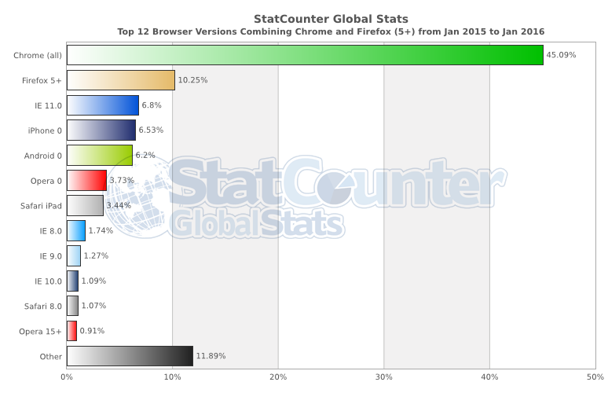

# Learn web browsers

> A web browser (commonly referred to as a browser) is a software application for retrieving, presenting, and traversing information resources on the World Wide Web. An information resource is identified by a Uniform Resource Identifier (URI/URL) and may be a web page, image, video or other piece of content. Hyperlinks present in resources enable users easily to navigate their browsers to related resources. Although browsers are primarily intended to use the World Wide Web, they can also be used to access information provided by web servers in private networks or files in file systems. - Wikipedia

##### The [most commonly used browsers](http://www.sitepoint.com/browser-trends-april-2015-statcounter-vs-netmarketshare/) (on any device) are:

1. [Chrome](http://www.google.com/chrome/) (engine: [Blink](https://en.wikipedia.org/wiki/Blink_%28layout_engine%29) + [V8](https://en.wikipedia.org/wiki/V8_%28JavaScript_engine%29))
2. [Firefox](https://www.mozilla.org/en-US/firefox/new/) (engine: [Gecko](https://en.wikipedia.org/wiki/Gecko_%28software%29) + [SpiderMonkey](https://en.wikipedia.org/wiki/SpiderMonkey_%28software%29))
3. [Internet Explorer](http://windows.microsoft.com/en-us/internet-explorer/download-ie) (engine: [Trident](https://en.wikipedia.org/wiki/Trident_%28layout_engine%29) + [Chakra](https://en.wikipedia.org/wiki/Chakra_%28JScript_engine%29))
4. [Safari](https://www.apple.com/safari/) (engine: [Webkit](https://en.wikipedia.org/wiki/WebKit) + [SquirrelFish](https://trac.webkit.org/wiki/SquirrelFish))

<cite>image source: <a href="http://gs.statcounter.com/#all-browser_version_partially_combined-ww-monthly-201408-201508-bar">http://gs.statcounter.com/#all-browser_version_partially_combined-ww-monthly-201408-201508-bar</a></cite>

##### Evolution of browsers & web technologies (i.e. API's)

* [www.evolutionoftheweb.com](http://www.evolutionoftheweb.com/) [read]
* [Timeline of web browsers](https://en.wikipedia.org/wiki/Timeline_of_web_browsers) [read]

##### The most commonly used headless browser are:

* [PhantomJS](http://phantomjs.org/) (engine: [Webkit](https://en.wikipedia.org/wiki/WebKit) + SquirrelFish)
* [slimerjs](http://slimerjs.org/) (engine: [Gecko](https://en.wikipedia.org/wiki/Gecko_%28software%29) + [SpiderMonkey](https://en.wikipedia.org/wiki/SpiderMonkey_%28software%29))
* [TrifleJS](http://triflejs.org/) (engine: [Trident](https://en.wikipedia.org/wiki/Trident_%28layout_engine%29) + [Chakra](https://en.wikipedia.org/wiki/Chakra_%28JScript_engine%29))

##### How browsers work

* [20 Things I Learned About Browsers and the Web](http://www.20thingsilearned.com/en-US/foreword/1) [read]
* [Fast CSS: How Browsers Lay Out Web Pages](http://dbaron.org/talks/2012-03-11-sxsw/master.xhtml) [read]
* [How Browsers Work: Behind the scenes of modern web browsers](http://www.html5rocks.com/en/tutorials/internals/howbrowserswork/) [read]
* [So How Does the Browser Actually Render a Website](https://www.youtube.com/watch?v=SmE4OwHztCc) [watch]

<cite>image source: <a href="http://www.html5rocks.com/en/tutorials/internals/howbrowserswork/">http://www.html5rocks.com/en/tutorials/internals/howbrowserswork/</a></cite>

##### Optimizing for browsers:

* [Browser Rendering Optimization](https://www.udacity.com/course/browser-rendering-optimization--ud860) [watch]
* [Website Performance Optimization](https://www.udacity.com/course/website-performance-optimization--ud884) [watch]

##### Browser security

* [Browser Security Handbook](https://code.google.com/p/browsersec/wiki/Main) [read]
* [Frontend Security](https://mikewest.org/2013/09/frontend-security-frontendconf-2013) [watch]
* [HTML5 Security Cheatsheet](https://html5sec.org/#javascript) [read]
* [Security for Web Developers: Using JavaScript, HTML, and CSS](http://www.amazon.com/Security-Web-Developers-Using-JavaScript/dp/1491928646/) [read][$]
* [The Tangled Web: A Guide to Securing Modern Web Applications](http://lcamtuf.coredump.cx/tangled/) [read]($)

##### Comparing browsers

* [Comparison of Web Browsers](https://en.wikipedia.org/wiki/Comparison_of_web_browsers) [read]

##### Developing for browsers

In the past, a front-end developer spent a lot of time making code work in several different browsers. This was once a bigger issue than it is today, unless you have to write code for older browsers (i.e. <IE8). This still remains an issue today, just not one that demands so much of the front-end developers time and brain cycles. The fact of the matter is modern abstractions (e.g. jQuery, pre-processors, transpilers) have done away with a lot of browser inconsistency issues.

##### Evergreen browsers

The latest versions of browsers are considered evergreen browsers. That is, in theory they are suppose to automatically update themselves silently without prompting the user. This move towards self updating browsers has been in reaction to the slow process of eliminating older browsers. Older browsers  are complicated to develop for given their deviations from the commonalities between modern browsers (i.e. new specifications and this rate of change).

##### Picking a browser

As of today, most front-end developers use Chrome and the tools available to a developer, "Chrome Dev Tools". However, all of the browsers offer a flavor of developer tools. Picking one to use for development is a subjective matter. The more important issue is knowing which browsers you have to support and testing in each as you develop. Select whichever browser makes sense to your brain and gets the job done. I suggest using Chrome simply because the developer tools are consistently improving and at this time contain the most robust features.

##### Browser hacks

* [browserhacks.com](http://browserhacks.com/) [read]

