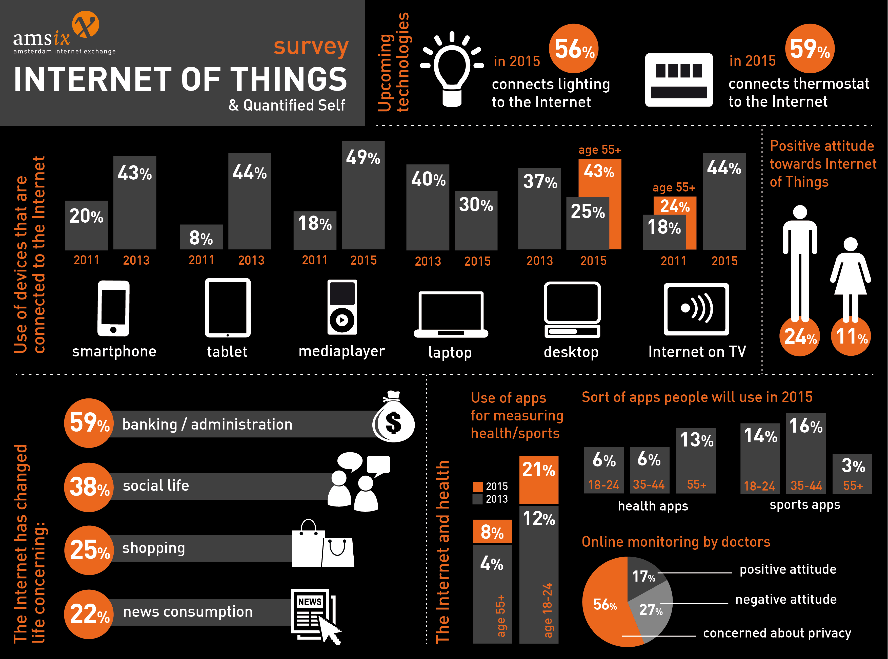

# Front-end developers develop for...

A front-end developer typically uses front-end technologies to create HTML, CSS, and JS that run on one of the following operating systems:

* Windows
* Windows Phone
* OSX
* iOS
* Android
* Ubuntu (or some flavor of )
* Chromium

These operating systems typically run on one or more of the following devices:

* Desktop computer
* Laptop / Netbook computer
* Mobile phone
* Tablet
* TV
* Watch
* Things (i.e. anything you can imagine, car, refrigerator, lights, thermostat etc..)

<cite>image source: <a href="https://ams-ix.net/newsitems/87">https://ams-ix.net/newsitems/87</a></cite>

Generally speaking, front-end technologies can run on the aforementioned operating systems and devices using the following run time scenarios:

* A web browser (e.g. [Chrome, IE, Safari, Firefox](http://outdatedbrowser.com/en)) running from OS
* A [headless browser](https://en.wikipedia.org/wiki/Headless_browser) (e.g. [phantomJS](http://phantomjs.org/)) driven from a CLI running on OS
* A [WebView](http://wiki.awesomium.com/general-use/introduction-to-web-views.html)/browser tab (think iframe) embedded within a native application as a runtime with bridge to native API's. UI is all web based. (e.g. [Apache Cordova](https://cordova.apache.org/), [NW.js](http://nwjs.io/), [Electron](http://electron.atom.io/))
* A native application built from web tech that is interpreted at runtime with a bridge to native API's. UI is native based. (e.g. [NativeScript](https://www.nativescript.org/), [React Native](https://facebook.github.io/react-native/))

 

