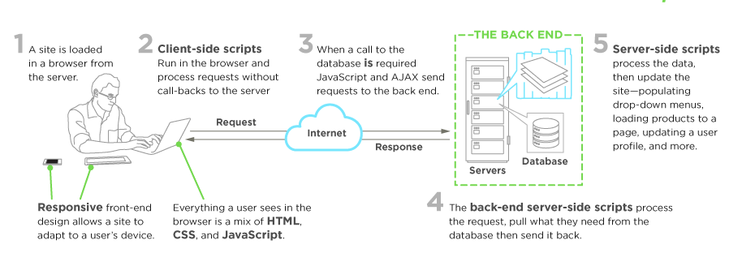

# What is a front-end developer?

A front-end developer architects and develops websites and applications using web technologies (i.e. HTML, CSS, DOM, and JavaScript) which run on the web platform or act as compilation input for non-web platform environments.

<cite>image source: <a href="https://www.upwork.com/hiring/development/front-end-developer/">https://www.upwork.com/hiring/development/front-end-developer/</a></cite>

Typically, a developer enters into the field of front-end development by developing HTML, CSS, and JS code to run in a [web browser](https://en.wikipedia.org/wiki/Web_browser), webview, or [headless browser](https://en.wikipedia.org/wiki/Headless_browser) which runs on a device enabled with web platform capabilities.

Web browsers typically run on a desktop, laptop, tablet, or phone but as of late a browser can be found on just about anything (i.e fridge, in cars, etc...). 

The most common web browsers are: 

* [Chrome](http://www.google.com/chrome/)
* [Internet Explorer](http://dev.modern.ie/)
* [Firefox](https://www.mozilla.org/firefox/) 
* [Safari](http://www.apple.com/safari/)

Webviews are used by a native OS to run web pages. Think of a webview like an iframe or a single tab from a web browser that is embedded in a native application running on device that runs iOS, android, windows, or OSX.

The most common solutions for webview development are:

* [Cordova](https://cordova.apache.org/)
* [NW.js](https://github.com/nwjs/nw.js)
* [Electron](http://electron.atom.io/)

Headless browsers are a web browser without a graphical user interface that can be controlled from a command line interface for the purpose of web page automation (e.g. functional testing, scraping, unit testing etc..).

The most common headless browsers are:

* [PhantomJS](http://phantomjs.org/)
* [slimerjs](http://slimerjs.org/)
* [trifleJS](http://triflejs.org/)

Eventually, what is learned from web browser development can be used by front-end developers to craft code for environments that are not fueled by a browser engine. As of late, development environments are being dreamed up that use web technologies (e.g. CSS and JavaScript), without web engines, to create truly native applications.

Some examples of these environments are: 

* [NativeScript](https://www.nativescript.org/)
* [React Native](https://facebook.github.io/react-native/)

